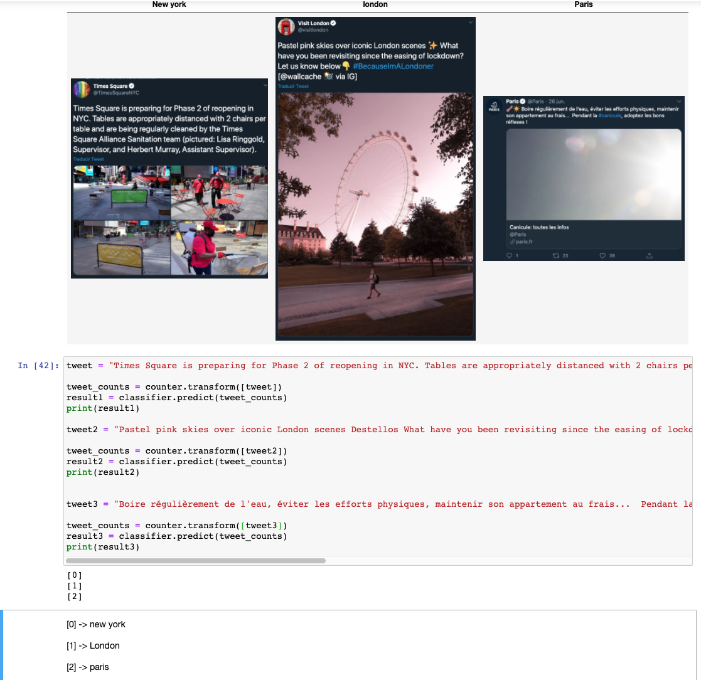
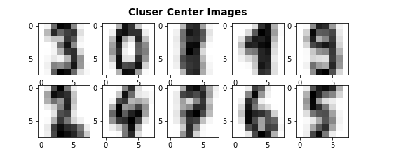

# projects
This is a repository for personal projects showing the use of data Science

# tweet Prediction
Is a supervisor machine learning to predict where is a tweet from london, new york, paris
Using the library **sklearn** and the algorithm Naive Bayes Classifier

# Handwriting Recognition using K-Means
The U.S. Postal Service has been using machine learning and scanning technologies since 1999. Because its postal offices have to look at roughly half a billion pieces of mail every day, they have done extensive research and developed very efficient algorithms for reading and understanding addresses. And not only the post office:

- ATMs can recognize handwritten bank checks
- Evernote can recognize handwritten task lists
- Expensify can recognize handwritten receipts

The numbers                 |  Result                  |
:-------------------------:|:-------------------------:|
    |     |
