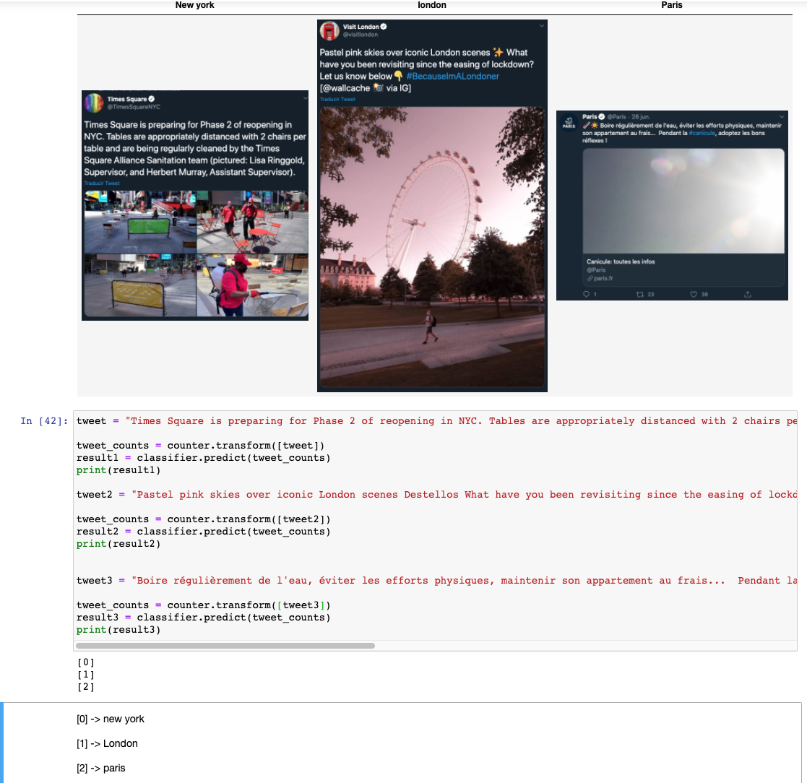

# projects
This is a repository for personal projects showing the use of data Science 

# tweet Prediction 
Is a supervisor machine learning to predict where is a tweet from london, new york, paris
Using the library **sklearn** and the algorithm Naive Bayes Classifier

